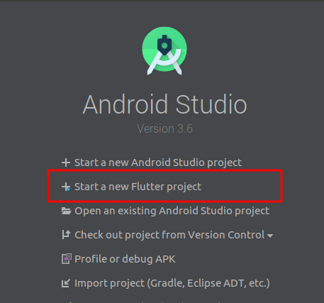
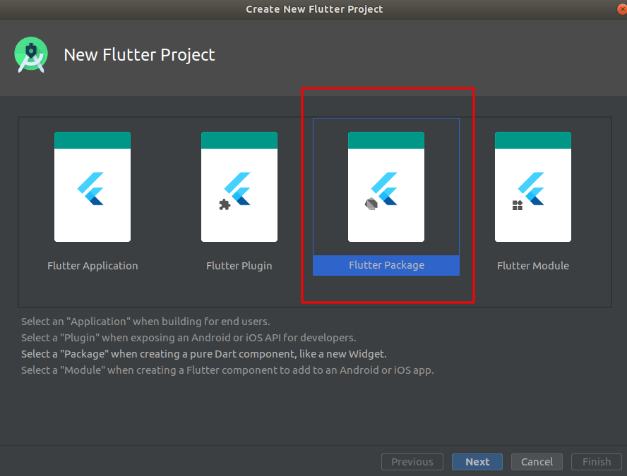
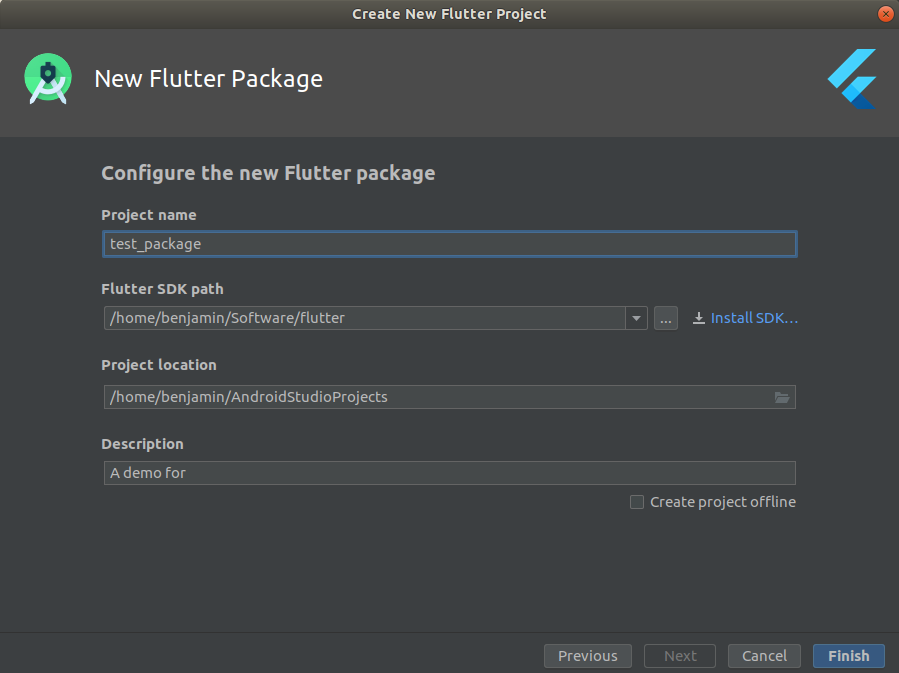
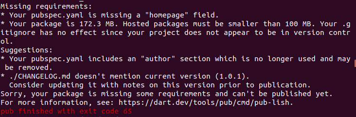
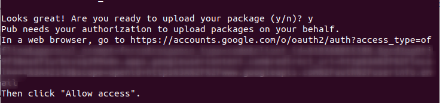
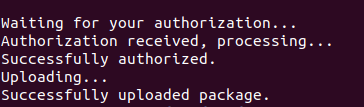

# How to publish your very own dart(flutter) package

Wouldn't it be nice if you publish a package based on your business's need and improves your team's collaboration without copy and paste code every time you want that specific feature?

No more worry, similar to publish a package in npm ecosystem, dart community make it as easy as possible in 4 steps.


## Steps to create a library project

### Using Android Studio to create

### Step 1


### Step 2


### Step 3
fill in your package information


After the you finish what stated above, Android Studio will open and do what it have to do, then you can start implement your own package under `you_package_name/lib/`

---

### Using Terminal to create

### Step 1
```bash
flutter create --template=package your_package_name
```

### Step 2
Go ahead using your favorite editor to implement the package.

---

## Create example project to test the package
Example project is not just for testing but for the demonstration of how your package will behave when customer use it, which will be displayed under the example tab on your package's page on `pub.dev` site.

Using terminal navigate to the package's folder and run
```
flutter create example
```

---

## Publish your package
Before publishing your package, you might want to run the it as `--dry-run` to ensure nothing is breaking.

```
flutter pub publish --dry-run 
```

Then please follow the suggestion to make your package meets the requirement of a standard dart package.

For instance, we can see from the following suggestion that




1. This package's pubspec.yaml is missing a 'homepage' field, which can be the github repo address if you don't have a website for the package
2. The package is too large that it exceed the minimum requirement of a package. It happens because the package didn't initialize as a git repository so that it include all the things inside the local package folder including those enlisting in the `.gitignore`
3. And there's some suggestions, they won't normally cause any harm but it better to follow its advice especially the `CHANGELOG` and the `LICENSE`

After everything is ready, you can see that it has 0 warnings.


Then let's publish it!

Run this in your terminal: (no --dry-run this time)
```
flutter pub publish
```

If you are first time publish a package, you will have this in your terminal asking for authorization




Next, just head to the browser to click 'Allow access', and all done!





Hooray! You just publish your very own dart package!
Next, you just need to go to your package page to see if there's anything need to improve for better score!